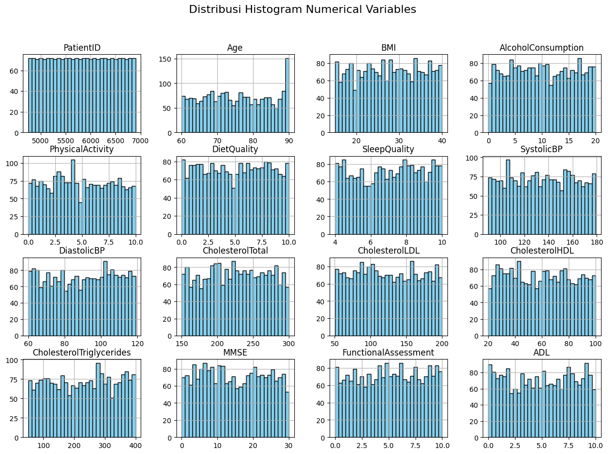
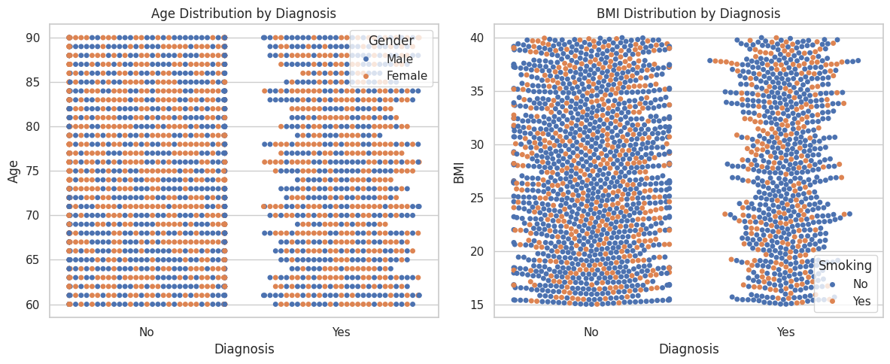
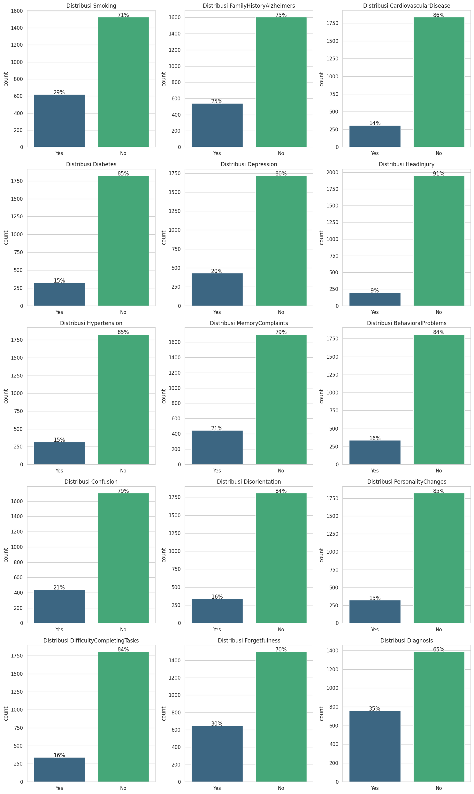
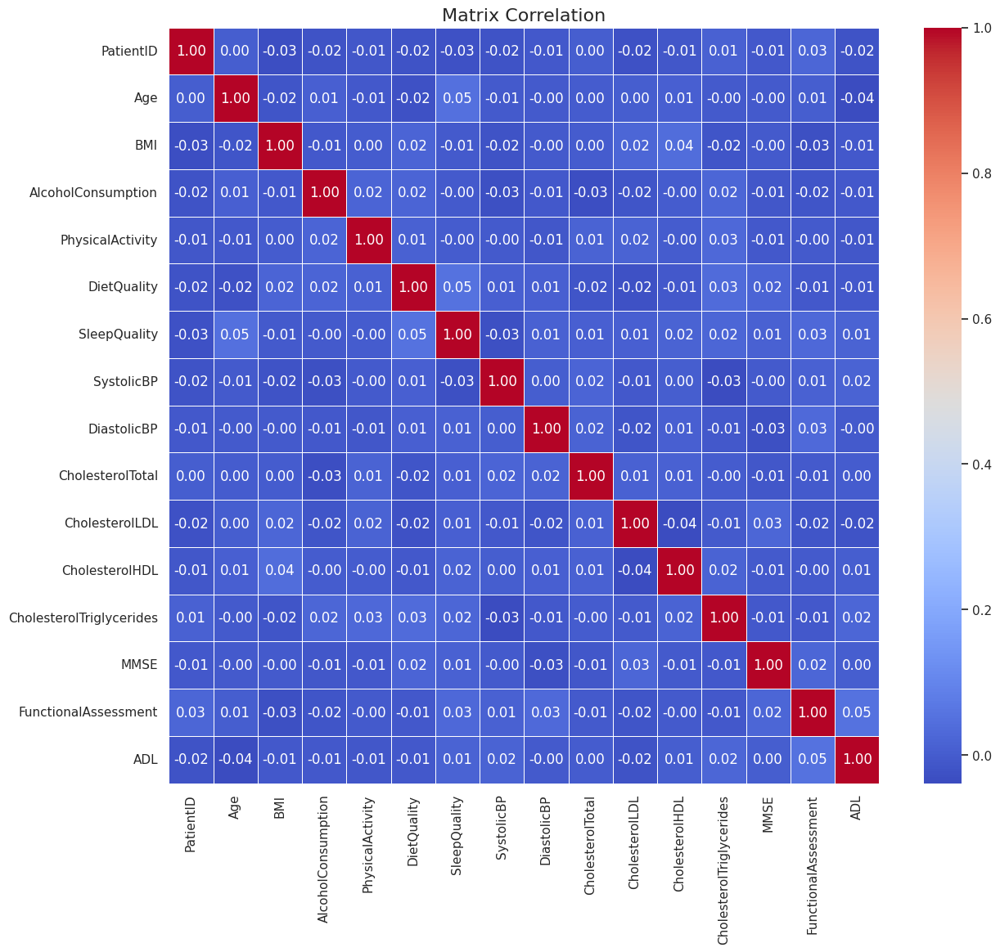
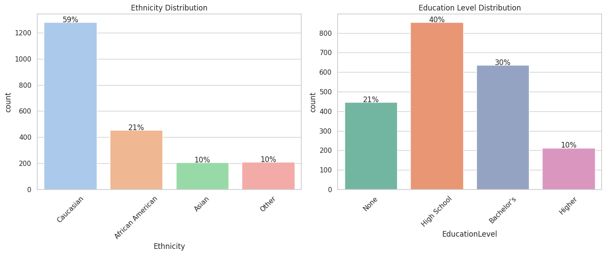
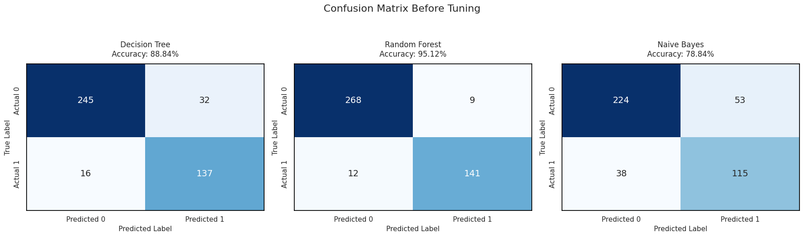
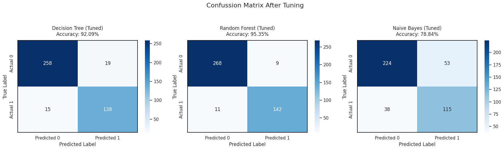
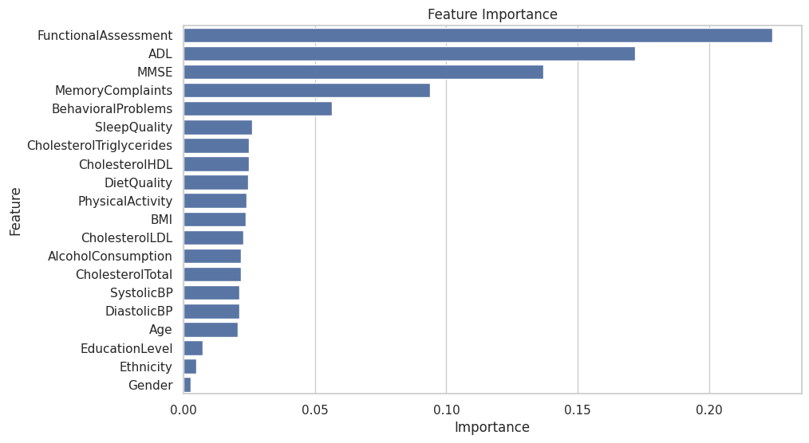

# Laporan Proyek Machine Learning Terapan - Muhammad Nandaarjuna Fadhillah
# Klasifikasi Penyakit Alzheimer Menggunakan Metode Random Forrest, Decision Tree, dan Naive Bayes

## Domain Proyek

### Latar Belakang dan Hasil Riset Penelitian Terkait

Penyakit Alzheimer merupakan salah satu bentuk penyakit neurodegeneratif progresif yang paling umum, ditandai dengan penurunan fungsi kognitif seperti daya ingat, kemampuan berpikir, kesehatan mental, serta fungsi psikologis lainnya yang berdampak pada aktivitas sehari-hari individu. Deteksi dini terhadap penyakit ini sangat penting guna meningkatkan efektivitas penanganan dan perawatan. Alzheimer juga diketahui sebagai penyebab utama demensia secara global, dengan prevalensi yang terus meningkat seiring bertambahnya usia populasi dunia. Kondisi ini menimbulkan tantangan besar bagi sistem pelayanan kesehatan, terutama dalam hal penyediaan diagnosis dan intervensi yang tepat. Meskipun berbagai terapi telah dikembangkan dan memasuki tahap klinis, efektivitasnya masih menjadi perdebatan dalam komunitas medis. Oleh karena itu, pengembangan metode identifikasi otomatis dengan tingkat akurasi yang tinggi menjadi sangat krusial dalam upaya mendukung deteksi dini dan diagnosis penyakit Alzheimer secara lebih efisien.

Dalam beberapa tahun terakhir, perkembangan teknologi machine learning telah menunjukkan kemajuan yang signifikan dan menjadi alat yang andal dalam mendukung berbagai aplikasi di bidang medis. Algoritma machine learning memiliki potensi untuk mengotomatiskan proses prediksi penyakit Alzheimer melalui kemampuan dalam mengenali pola-pola tersembunyi dari data secara efisien. Dengan penerapan metode yang tepat, model ini dapat menghasilkan prediksi yang akurat dan berkontribusi sebagai dasar pengambilan keputusan dalam proses diagnosis dan penanganan penyakit Alzheimer. 

Hasil riset menunjukkan bahwa model algoritma machine learning seperti Logistic Regression, Support Vector Machine, Naïve Bayes, dan Random Forest dapat digunakan untuk mendeteksi penyakit Alzheimer secara otomatis dengan tingkat akurasi yang cukup tinggi. Khususnya, Logistic Regression mampu mencapai tingkat akurasi sebesar 85,71% berdasarkan data dari Kaggle, dan algoritma lain seperti SVM juga menunjukkan hasil yang baik dengan akurasi hingga 92,00% dalam studi sebelumnya. Penelitian ini menegaskan pentingnya penggunaan model machine learning untuk deteksi dini Alzheimer guna meningkatkan efektivitas diagnosis dan penanganan penyakit ini.

Referensi:
[Komparasi Algoritma Machine Learning Untuk Memprediksi Penyakit Alzheimer](https://jurnal.pcr.ac.id/index.php/jkt/article/view/5713)

## Business Understanding
Menjelaskan proses klarifikasi masalah

### Problem Statements (Pernyataan Masalah)
Berikut merupakan permasalahan yang akan diselesaikan pada proyek ini :
1. Bagaimanakah pengembangan model klasifikasi yang mampu mengidentifikasi penyakit Alzheimer berdasarkan sejumlah indikator kesehatan tertentu guna mendukung upaya deteksi dini?
2. Algoritma machine learning manakah yang mampu memberikan performa terbaik dalam melakukan klasifikasi terhadap penyakit Alzheimer?
3. Apa saja faktor utama yang berperan penting dalam menentukan klasifikasi penyakit Alzheimer?

### Goals (Tujuan)
Menjelaskan tujuan dari permasalahan yang didapat :
1. Membangun suatu model klasifikasi yang dapat mengidentifikasi tanda-tanda Alzheimer secara akurat berdasarkan parameter kesehatan tertentu.
2. Membandingkan kinerja berbagai algoritma machine learning dalam mengklasifikasikan Alzheimer berdasarkan dataset yang tersedia.
3. Mengidentifikasi faktor dominan yang paling berkontribusi terhadap klasifikasi Alzheimer sesuai dengan fitur yang ada pada dataset.

### Solution Statements
1. Solusi untuk Pengembangan Model Klasifikasi
   - Bangun model baseline dengan algoritma sederhana (Random Forrest, Decision Tree, & Naive Bayes) sebagai pembanding.
   - Hyperparameter Tuning menggunakan Bayesian Optimization untuk optimasi
2. Solusi untuk Pemilihan Algoritma Terbaik
   - Uji 3 Algoritma dengan dataset yang sama 
   - Mengatasi Ketidakseimbangan data dengan Undersampling
   - Bandingkan hasil menggunakan Metrik Evaluasi dan Confussion Matrix
3. Solusi untuk analisis fitur/faktor dominan
   - Menggunakan model machine learning seperti random forrest untuk mendapatkan kontribusi fitur
   - Memvisualisasikan analisis fitur yang berkontribusi

## Data Understanding

### Deskripsi Dataset
Dataset ini mencakup informasi kesehatan mendetail dari 2.149 pasien, dengan setiap pasien memiliki ID unik berkisar antara 4751 hingga 6900. Data yang tersedia meliputi:
- Detail demografis (usia, jenis kelamin, pendidikan, dll.).
- Faktor gaya hidup (kebiasaan merokok, pola makan, aktivitas fisik).
- Riwayat medis (penyakit penyerta, pengobatan sebelumnya).
- Pengukuran klinis (tekanan darah, kadar biomarker, hasil tes laboratorium).
- Penilaian kognitif dan fungsional (skor MMSE, ADAS-Cog, aktivitas sehari-hari).
- Gejala-gejala spesifik.
- Diagnosis Alzheimer’s Disease (dalam kategori seperti: Normal, MCI [Mild Cognitive Impairment], Alzheimer).

### Kegunaan Dataset
- Peneliti medis yang ingin mengeksplorasi faktor-faktor terkait Alzheimer.
- Ilmuwan data yang membangun model prediktif untuk deteksi dini.
- Analisis statistik (uji korelasi, klasifikasi, atau regresi).

Sumber Dataset: [Kaggle](https://www.kaggle.com/datasets/rabieelkharoua/alzheimers-disease-dataset/data)

### Variabel-variabel pada 🧠 Alzheimer's Disease Dataset 🧠
- **Patient ID**
1. ID Pasien: Pengidentifikasi unik untuk setiap pasien (4751 hingga 6900)
- **Detail Demografi**
2. Usia                         : Usia pasien dalam rentang 60 hingga 90 tahun
3. Jenis Kelamin                : 0: Laki-laki, 1: Perempuan
4. Etnis                        : 0: Kaukasia, 1: Afrika Amerika, 2: Asia, 3: Lainnya
5. Tingkat Pendidikan           : 0: Tidak sekolah, 1: Sekolah Menengah, 2: Sarjana, 3: Pendidikan lebih tinggi
- **Faktor Gaya Hidup**
6. BMI/IMT (Indeks Massa Tubuh) : Nilai antara 15 hingga 40
7. Status Merokok               : 0: Tidak, 1: Ya
8. Konsumsi Alkohol             : Jumlah unit per minggu (0-20)
9. Aktivitas Fisik              : Jam per minggu (0-10)
10. Kualitas Diet               : Skor 0-10
11. Kualitas Tidur              : Skor 4-10
- **Riwayat Penyakit**
12. Riwayat Keluarga Alzheimer  : 0: Tidak, 1: Ya
13. Penyakit Kardiovaskular     : 0: Tidak, 1: Ya
14. Diabetes                    : 0: Tidak, 1: Ya
15. Depresi                     : 0: Tidak, 1: Ya
16. Riwayat Cedera Kepala       : 0: Tidak, 1: Ya
17. Hipertensi                  : 0: Tidak, 1: Ya
- **Pengukuran Klinis**
18. Tekanan Darah Sistolik                                      : 90-180 mmHg
19. Tekanan Darah Diastolik                                     : 60-120 mmHg
20. Kolesterol Total                                            : 150-300 mg/dL
21. Kolesterol LDL (Low-density lipoprotein cholesterol levels) : 50-200 mg/dL
22. Kolesterol HDL (High-density lipoprotein cholesterol levels): 20-100 mg/dL
23. Trigliserida                                                : 50-400 mg/dL
- **Penilaian Kognitif dan Fungsional**
24. Skor MMSE (Mini-Mental State Examination) : 0-30 (skor lebih rendah menunjukkan gangguan kognitif)
25. Penilaian Fungsional                      : Skor 0-10 (skor lebih rendah menunjukkan gangguan lebih berat)
26. Keluhan Memori                            : 0: Tidak, 1: Ya
27. Masalah Perilaku                          : 0: Tidak, 1: Ya
28. ADL (Kemampuan Aktivitas Sehari-hari)     : Skor 0-10 (skor lebih rendah menunjukkan gangguan lebih berat)
- **Gejala**
29. Kebingungan                   : 0: Tidak, 1: Ya   
30. Disorientasi                  : 0: Tidak, 1: Ya
31. Perubahan Kepribadian         : 0: Tidak, 1: Ya
32. Kesulitan Menyelesaikan Tugas : 0: Tidak, 1: Ya
33. Pelupa                        : 0: Tidak, 1: Ya
- **Diagnosis**
34. Diagnosis Alzheimer         : 0: Tidak, 1: Ya
- **Nama Dokter(Confidential Information)**
35. Dokter Penanggung Jawab     : Kolom ini berisi informasi rahasia dokter dengan nilai "XXXConfid" untuk semua pasien

### Kondisi Data

1. Missing Value
Missing Value (Nilai yang Hilang) mengacu pada data yang tidak tercatat atau tidak tersedia dalam dataset. 
```
print("\nMissing Values per Column:")
for col in dataset.columns:
    print(f"{col:20} : {dataset[col].isna().sum()}")
```
Output :
```
Missing Values per Column:
PatientID            : 0
Age                  : 0
Gender               : 0
Ethnicity            : 0
EducationLevel       : 0
BMI                  : 0
Smoking              : 0
AlcoholConsumption   : 0
PhysicalActivity     : 0
DietQuality          : 0
SleepQuality         : 0
FamilyHistoryAlzheimers : 0
CardiovascularDisease : 0
Diabetes             : 0
Depression           : 0
HeadInjury           : 0
Hypertension         : 0
SystolicBP           : 0
DiastolicBP          : 0
CholesterolTotal     : 0
CholesterolLDL       : 0
CholesterolHDL       : 0
CholesterolTriglycerides : 0
MMSE                 : 0
FunctionalAssessment : 0
MemoryComplaints     : 0
BehavioralProblems   : 0
ADL                  : 0
Confusion            : 0
Disorientation       : 0
PersonalityChanges   : 0
DifficultyCompletingTasks : 0
Forgetfulness        : 0
Diagnosis            : 0
DoctorInCharge       : 0
```

2. Duplicated Data
Duplicated Data mengacu pada catatan (baris/record) dalam dataset yang memiliki nilai identik atau hampir identik pada seluruh atau sebagian kolom.
```
print("\nDataset Duplicated:")
display(dataset.duplicated().sum())
```
Output :
```
Dataset Duplicated:
np.int64(0)
```

3. Outlier
Outlier adalah data point yang secara signifikan berbeda dari mayoritas data dalam sebuah dataset.
```
# detect outlier with IQR methods
def detect_outliers_iqr(data, column):
    Q1 = data[column].quantile(0.25)
    Q3 = data[column].quantile(0.75)
    IQR = Q3 - Q1
    lower_bound = Q1 - 1.5 * IQR
    upper_bound = Q3 + 1.5 * IQR
    outliers = data[(data[column] < lower_bound) | (data[column] > upper_bound)]
    return outliers

# Outlier detection
outliers = detect_outliers_iqr(dataset, col)
print(f"{col}: {len(outliers)} outlier found")
```
Output :
```
PatientID: 0 outlier found
Age: 0 outlier found
BMI: 0 outlier found
AlcoholConsumption: 0 outlier found
PhysicalActivity: 0 outlier found
DietQuality: 0 outlier found
SleepQuality: 0 outlier found
SystolicBP: 0 outlier found
DiastolicBP: 0 outlier found
CholesterolTotal: 0 outlier found
CholesterolLDL: 0 outlier found
CholesterolHDL: 0 outlier found
CholesterolTriglycerides: 0 outlier found
MMSE: 0 outlier found
FunctionalAssessment: 0 outlier found
ADL: 0 outlier found
```

4. Informasi Data
ringkasan cepat (summary) tentang struktur dataset, termasuk tipe data, jumlah nilai non-null, dan penggunaan memori.
```
print("\nDataset Information:")
dataset.info()
```
Output : 
```
Dataset Information:
<class 'pandas.core.frame.DataFrame'>
RangeIndex: 2149 entries, 0 to 2148
Data columns (total 35 columns):
 #   Column                     Non-Null Count  Dtype  
---  ------                     --------------  -----  
 0   PatientID                  2149 non-null   int64  
 1   Age                        2149 non-null   int64  
 2   Gender                     2149 non-null   int64  
 3   Ethnicity                  2149 non-null   int64  
 4   EducationLevel             2149 non-null   int64  
 5   BMI                        2149 non-null   float64
 6   Smoking                    2149 non-null   int64  
 7   AlcoholConsumption         2149 non-null   float64
 8   PhysicalActivity           2149 non-null   float64
 9   DietQuality                2149 non-null   float64
 10  SleepQuality               2149 non-null   float64
 11  FamilyHistoryAlzheimers    2149 non-null   int64  
 12  CardiovascularDisease      2149 non-null   int64  
 13  Diabetes                   2149 non-null   int64  
 14  Depression                 2149 non-null   int64  
 15  HeadInjury                 2149 non-null   int64  
 16  Hypertension               2149 non-null   int64  
 17  SystolicBP                 2149 non-null   int64  
 18  DiastolicBP                2149 non-null   int64  
 19  CholesterolTotal           2149 non-null   float64
 20  CholesterolLDL             2149 non-null   float64
 21  CholesterolHDL             2149 non-null   float64
 22  CholesterolTriglycerides   2149 non-null   float64
 23  MMSE                       2149 non-null   float64
 24  FunctionalAssessment       2149 non-null   float64
 25  MemoryComplaints           2149 non-null   int64  
 26  BehavioralProblems         2149 non-null   int64  
 27  ADL                        2149 non-null   float64
 28  Confusion                  2149 non-null   int64  
 29  Disorientation             2149 non-null   int64  
 30  PersonalityChanges         2149 non-null   int64  
 31  DifficultyCompletingTasks  2149 non-null   int64  
 32  Forgetfulness              2149 non-null   int64  
 33  Diagnosis                  2149 non-null   int64  
 34  DoctorInCharge             2149 non-null   object 
dtypes: float64(12), int64(22), object(1)
memory usage: 587.7+ KB
```

### Exploratory Data Analysis (EDA)
Untuk memperoleh pemahaman yang lebih mendalam tentang data, dilakukan Analisis Data Eksplorasi (Exploratory Data Analysis/EDA)

1. 📊 Distribusi Histogram Variabel Numerik
Histogram-histogram tersebut menunjukkan frekuensi nilai masing-masing fitur numerik dalam dataset. Ini sangat penting untuk melihat:
- Skewness (kemiringan distribusi)
- Outlier (jika terlihat ujung-ujung yang menjulang)
- Distribusi normal atau tidak
- Potensi scaling (normalisasi/standardisasi)

✅ Distribusi Umum:
Sebagian besar fitur terdistribusi cukup merata atau mendekati normal.
Tidak ada distribusi yang ekstrem aneh seperti heavy skew atau zero-inflated, jadi aman untuk preprocessing ringan.


2. 🔢 Distribusi Bivariate Variabel
Visualisasi ini terdiri dari dua plot yang menunjukkan hubungan antara Diagnosis dengan dua variabel numerik: Age (usia) dan BMI (Body Mass Index), serta dua variabel kategorikal: Gender dan Smoking.

📊 Kiri: Age Distribution by Diagnosis
- Sumbu Y: Usia (Age), dari 60 hingga 90 tahun.
- Sumbu X: Diagnosis, yaitu apakah seseorang mendapat diagnosis atau tidak (No atau Yes).
- Warna Titik: Biru: Male, Oranye: Female
Interpretasi:
- Usia pasien dengan dan tanpa diagnosis berada dalam rentang yang mirip (60–90 tahun).
- Distribusi gender tampak seimbang antara laki-laki dan perempuan dalam kedua kategori diagnosis.
- Tidak tampak adanya konsentrasi jelas pada rentang usia tertentu untuk pasien dengan diagnosis.

📊 Kanan: BMI Distribution by Diagnosis
- Sumbu Y: BMI, dari sekitar 15 hingga 40.
- Sumbu X: Diagnosis (No atau Yes).
- Warna Titik: Biru: Non-Smoker, Oranye: Smoker
Interpretasi:
- BMI pasien yang didiagnosis (Yes) dan tidak didiagnosis (No) memiliki rentang nilai yang mirip.
- Tampaknya lebih banyak pasien non-smoker dibanding smoker di kedua kategori diagnosis.


Visualisasi ini menunjukkan distribusi jawaban (Yes/No) dari berbagai variabel biner dalam dataset. Berikut adalah ringkasan utama:
- Sebagian besar responden memiliki nilai "No" untuk hampir semua fitur — menunjukkan prevalensi rendah untuk kondisi seperti:
  * Smoking (71% No)
  * Diabetes (85% No)
  * CardiovascularDisease (86% No)
  * Hypertension (85% No)
  * Depression (80% No)
  * MemoryComplaints, Confusion, Disorientation, dll. (sekitar 79–85% No)
- Variabel "Diagnosis" sendiri menunjukkan bahwa 65% peserta belum terdiagnosis, sementara 35% sudah terdiagnosis.
- Hanya Forgetfulness dan FamilyHistoryAlzheimers yang memiliki distribusi "Yes" sedikit lebih tinggi dibandingkan fitur lainnya (masing-masing 30% dan 25%).


3. 🔢 Distribusi Multivariate Variabel
- 🌡️ Analisis Visualisasi Korelasi dengan Heatmap
Visualisasi yang ditampilkan adalah heatmap matriks korelasi yang menunjukkan hubungan linear antar variabel numerik dalam dataset.
💡 Penjelasan Umum:
- Skala warna:
  * Merah = korelasi positif kuat (mendekati +1)
  * Biru = korelasi negatif kuat (mendekati -1)
  * Biru Gelap ≈ 0 = tidak ada atau korelasi sangat lemah
- Nilai korelasi berkisar dari -1 (negatif sempurna) hingga +1 (positif sempurna).
- Diagonal utama selalu 1.00 karena setiap variabel dikorelasikan dengan dirinya sendiri.
🔍 Temuan Penting:
1. Korelasi Kuat                : FunctionalAssessment dan ADL (Activities of Daily Living): 0.05 → walau kecil, ini yang paling tinggi di luar hubungan antar diri sendiri.
2. Korelasi Lemah atau Tidak Ada: Hampir semua variabel lain memiliki korelasi sangat rendah atau mendekati nol.
3. Korelasi Negatif Lemah       : Age vs ADL: -0.04 → menunjukkan semakin tua seseorang, sedikit penurunan dalam ADL, tapi hubungannya lemah sekali.


4. 🧪 Distribusi Ras dan Tingkat Pendidikan
Visualisasi ini menunjukkan distribusi etnisitas dan tingkat pendidikan responden:
Dataset didominasi oleh responden Caucasian dengan latar belakang pendidikan menengah (SMA).


## Data Preparation 🧹
Data preparation merupakan tahapan penting dalam proses pengembangan model machine learning. Ini adalah tahap di mana kita melakukan proses transformasi pada data sehingga menjadi bentuk yang cocok untuk proses pemodelan.
Pada bagian ini dilakukan beberapa tahapan persiapan data, yaitu:

1. 🧼 Drop kolom yang tidak dipakai untuk melakukan model development 
Penghapusan fitur ini dilakukan karena kolom `PatientID` dan `DoctorInCharge` tidak memiliki nilai prediktif dalam pengembangan model.
```
modelling_df = dataset.copy()
modelling_df = modelling_df.drop(['PatientID','DoctorInCharge'], axis=1)
modelling_df.head().T
```

2. 🧮 Memisahkan fitur independen dan dependen (target)
Tahapan ini dilakukan karena :
- Kebutuhan Struktur Data dalam Machine Learning
- Operasi seperti normalisasi hanya perlu diaplikasikan ke X
```
X = modelling_df.drop('Diagnosis', axis=1)
y = modelling_df['Diagnosis']
```

3. ⚙️ Standarisasi menggunakan *MinMaxScaler*
Standarisasi (standardization) adalah proses transformasi fitur numerik agar memiliki mean = 0 dan standar deviasi = 1. ini dilakukan karena :
- Normalisasi Skala Fitur
- Stabilitas Numerik untuk Mencegah overflow/underflow dalam perhitungan matriks
- Akurat (khususnya untuk algoritma sensitif skala)
- Interpretabel (koefisien yang meaningful)
```
scaler = MinMaxScaler()
X_array = scaler.fit_transform(X)
X_scaled = pd.DataFrame(X_array, columns=X.columns)

quantile_transformer = QuantileTransformer(output_distribution='normal')
X_scaled = quantile_transformer.fit_transform(X_scaled)
```

4. 📦 Splitting data menjadi train dan test
- Mengukur performa model secara realistis
- Model harus diuji pada data yang belum pernah dilihat selama pelatihan
- Indikator Overfitting
- Memastikan teknik preprocessing (seperti standarisasi) tidak bocor ke data test
```
X_train, X_test, y_train, y_test = train_test_split(X_scaled, y, test_size=0.2, random_state=42)

counter_sorted = dict(sorted(Counter(y).items()))
print("Class Distribution Before Undersampling:", counter_sorted)
```
Output :
`Class Distribution Before Undersampling: {0: 1389, 1: 760}`

5. 🗃️ Menggunakan teknik Undersampling
teknik penyeimbangan data dengan cara mengurangi jumlah sampel dari kelas mayoritas agar proporsinya seimbang dengan kelas minoritas. Alasan menggunakan teknik ini antara lain:
- Mengatasi Bias Model terhadap Kelas Mayoritas
- Meningkatkan Metrik yang Relevan
- Keseimbangan dalam Algoritma yang Sensitif terhadap Distribusi Kelas
```
undersample = RandomUnderSampler(random_state=42)
X_train_under, y_train_under = undersample.fit_resample(X_train, y_train)
counter_sorted = dict(sorted(Counter(y_train_under).items()))

print("Class Distribution After Undersampling:", counter_sorted)
```
Output :
`Class Distribution After Undersampling: {0: 607, 1: 607}`

## 🤖 Model Development
Model development adalah alur kerja sistematis untuk membangun model machine learning yang efektif, mulai dari persiapan data hingga evaluasi akhir.
Pada tahap ini, akan dilakukan pembangunan model machine learning menggunakan tiga algoritma yang berbeda. Selanjutnya, setiap model akan dievaluasi performanya untuk mengetahui tingkat akurasi prediksi masing-masing. Tujuannya adalah untuk mengidentifikasi algoritma yang memberikan hasil prediksi paling optimal. Adapun tiga algoritma yang akan digunakan antara lain:

1. Random Forrest
Algoritma Random Forest bekerja dengan membuat sejumlah subset dari data pelatihan melalui teknik bootstrap (pengambilan sampel dengan pengembalian). Untuk setiap subset tersebut, dibangun sebuah pohon keputusan dengan pembatasan terhadap jumlah fitur yang dipertimbangkan pada tiap percabangan. Prediksi akhir kemudian ditentukan berdasarkan hasil voting mayoritas (untuk klasifikasi) atau rata-rata (untuk regresi) dari seluruh pohon yang terbentuk.

Dalam implementasi ini, model Random Forest menggunakan parameter default sebagai berikut:
- n_estimators      = 100: Jumlah pohon keputusan yang dibangun dalam ensemble.
- max_depth         = None: Setiap pohon akan tumbuh hingga semua daun murni atau tidak dapat dibagi lagi.
- min_samples_split = 2: Minimal dua sampel dibutuhkan untuk membagi sebuah node.
- max_features      = 'sqrt': Jumlah fitur yang dipertimbangkan pada setiap pemisahan node adalah akar kuadrat dari total fitur.
- bootstrap         = True: Menggunakan metode bootstrap untuk membuat subset data pelatihan bagi setiap pohon.

2. Decision Tree
Algoritma Decision Tree bekerja dengan membagi data berdasarkan fitur yang memberikan informasi paling besar dalam mengurangi impuritas (seperti Gini impurity atau entropy). Proses pembagian ini dilakukan secara rekursif, membentuk struktur seperti pohon, di mana setiap node merepresentasikan suatu kondisi pada fitur tertentu, dan daun (leaf) merepresentasikan hasil prediksi kelas. Pemilihan fitur terbaik dilakukan dengan menghitung seberapa besar peningkatan “purity” yang diperoleh dari pemisahan tersebut.

Dalam implementasi ini, model Decision Tree menggunakan parameter default sebagai berikut:
- criterion = 'gini': Menggunakan indeks Gini untuk mengukur kualitas pembagian.
- max_depth = None: Pohon akan tumbuh hingga semua daun murni (impuritas nol) atau hingga tidak ada pembagian yang bisa dilakukan lagi.
- min_samples_split = 2: Minimal dua sampel dibutuhkan pada suatu node untuk dapat membaginya.
- min_samples_leaf = 1: Setiap daun minimal memiliki satu sampel.
- max_features = None: Semua fitur akan dipertimbangkan saat mencari pemisahan terbaik.
- splitter = 'best': Menggunakan strategi terbaik untuk memilih pembagian pada setiap node (bukan secara acak).

3. Naive Bayes
Algoritma ini menghitung probabilitas prior untuk setiap kelas dan probabilitas kondisional untuk setiap fitur terhadap kelas tersebut. Kemudian, dihitung probabilitas posterior untuk setiap kelas berdasarkan input baru, dan hasil prediksi diambil dari kelas dengan probabilitas tertinggi.

Dalam implementasi ini, model GaussianNB digunakan dengan parameter default sebagai berikut:
- priors = None: Probabilitas awal kelas dihitung langsung dari distribusi kelas dalam data pelatihan (bukan ditentukan manual).
- var_smoothing = 1e-9: Nilai kecil yang ditambahkan ke varians untuk mencegah pembagian dengan nol atau varian yang terlalu kecil (menstabilkan perhitungan probabilitas).

📊 Perbandingan Model Machine Learning
```
|--------------------------|-------------------------------------------|---------------------------------------------|------------------------------------------------------------|
| **Aspek**                | **Random Forrest**                        | **Decision Tree**                           | **Naive Bayes**                                            |
|--------------------------|-----------------------------------------------------------------------------------------|------------------------------------------------------------|
|                          | - Akurasi tinggi                          | - Mudah dipahami & divisualisasikan         | - Cepat & efisien pada data besar                          |
| **Kelebihan**            | - Tahan terhadap overfitting              | - Cepat untuk data kecil                    | - Sederhana & mudah diimplementasikan                      |
|                          | - Dapat menangani data besar dan kompleks | - Menangani data numerik & kategorikal      | - Bekerja baik dengan data teks atau klasifikasi sederhana |
|                          | - Bisa mengukur pentingnya fitur          |                                             |                                                            |
|--------------------------|-------------------------------------------|---------------------------------------------|------------------------------------------------------------|
|                          | - Interpretasi sulit (black box)          | - Rentan terhadap overfitting               | - Asumsi independensi fitur sering tidak realistis         |
| **Kekurangan**           | - Lebih lambat saat prediksi              | - Sensitif terhadap perubahan kecil di data | - Tidak cocok untuk fitur numerik non-Gaussian             |
|                          | - Memerlukan sumber daya lebih besar      | - Tidak sekuat ensemble method              | - Kurang fleksibel                                         |
|--------------------------|-------------------------------------------|---------------------------------------------|------------------------------------------------------------|
```

## 🧪 Evaluasi
Evaluasi model adalah proses penting dalam machine learning untuk mengukur seberapa baik model bekerja dalam memprediksi hasil yang benar pada data yang belum pernah dilihat sebelumnya (data uji). Evaluasi ini membantu kita memahami akurasi, keandalan, dan kelemahan dari model yang dibangun.

Tujuan Evaluasi Model:
- Mengetahui kinerja prediktif model
- Membandingkan beberapa model untuk memilih yang terbaik
- Mendeteksi overfitting atau underfitting
- Menentukan apakah model sudah cukup baik untuk diterapkan pada data nyata

Metode Evaluasi Klasifikasi:
1. **Confusion Matrix** : Matriks yang menunjukkan jumlah prediksi benar dan salah berdasarkan kelas
- True Positive (TP): Prediksi positif yang benar.
- True Negative (TN): Prediksi negatif yang benar.
- False Positive (FP): Prediksi positif yang salah.
- False Negative (FN): Prediksi negatif yang salah.
```

               | Prediksi Positif    | Prediksi Negatif    |
---------------|---------------------|---------------------|
Aktual Positif | TP (True Positive)  | FN (False Negative) |
Aktual Negatif | FP (False Positive) | TN (True Negative)  |
```

2. **Accuracy (Akurasi)** : Mengukur proporsi prediksi yang benar terhadap seluruh prediksi.
`Akurasi = (TP + TN) / TP + TN + FP + FN` 

3. **Precision (Presisi)** : Mengukur seberapa tepat model saat memprediksi kelas positif.
`Presisi = TP / (TP + FP)`

4. **Recall (Sensitivity atau True Positive Rate)** : Mengukur seberapa baik model menangkap semua data positif.
`TP / (TP + FN)`

5. **F1-Score** : Rata-rata harmonis dari precision dan recall. Cocok digunakan saat kelas tidak seimbang.
`F1 Score = 2 x ( (Presisi x Recall) / (Presisi + Recall) )`

### 📈 Hasil Evaluasi Sebelum Hyperparameter Tuning

**Perbandingan hasil akurasi dari 3 model yang dilatih**
```
📌 Metric Evaluation Before Tuning:

| Model         |   Accuracy |   Precision |   Recall |   F1 Score |
|:--------------|-----------:|------------:|---------:|-----------:|
| Decision Tree |   0.888372 |    0.874674 | 0.889951 |   0.880856 |
| Random Forest |   0.951163 |    0.948571 | 0.944539 |   0.946496 |
| Naive Bayes   |   0.788372 |    0.769743 | 0.780149 |   0.77384  |
```
✅ Random Forest
- Akurasi Tertinggi (95.1%) menunjukkan model ini membuat prediksi yang sangat akurat secara keseluruhan.
- Precision dan Recall tinggi (≥ 94%) berarti model jarang salah dalam memprediksi positif dan berhasil menangkap sebagian besar kelas positif.
- F1 Score tertinggi (94.6%) menandakan keseimbangan antara precision dan recall sangat baik.
➕ Cocok untuk implementasi karena performa stabil dan generalisasi baik.

🌳 Decision Tree
- Akurasi cukup tinggi (88.8%), menunjukkan performa yang masih kompetitif.
- Precision dan recall seimbang (~88%), artinya model masih baik dalam mendeteksi positif dan tidak terlalu banyak false positives.
- F1 Score baik (88.0%), menandakan model cukup seimbang meskipun sedikit di bawah Random Forest.
➖ Lebih sederhana, tapi sedikit kalah dari sisi akurasi dan generalisasi dibanding Random Forest.

📦 Naive Bayes
- Akurasi paling rendah (78.8%) dibanding model lain.
- Precision & Recall rendah (~77–78%), menandakan model sering keliru dalam memprediksi, terutama bila fitur tidak independen.
- F1 Score juga paling rendah (77.4%), menunjukkan performa kurang memadai pada dataset ini.
➖ Model cepat & ringan, namun asumsi independensi fitur kemungkinan tidak terpenuhi di data ini.

**Laporan Klasifikasi dari 3 model yang telah dilatih**
```
📌 Classification Report Before Tuning:

📌 Classification Report - Decision Tree:

|              |   precision |   recall |   f1-score |    support |
|:-------------|------------:|---------:|-----------:|-----------:|
| 0            |    0.938697 | 0.884477 |   0.910781 | 277        |
| 1            |    0.810651 | 0.895425 |   0.850932 | 153        |
| accuracy     |    0.888372 | 0.888372 |   0.888372 |   0.888372 |
| macro avg    |    0.874674 | 0.889951 |   0.880856 | 430        |
| weighted avg |    0.893137 | 0.888372 |   0.889486 | 430        |

📌 Classification Report - Random Forest:

|              |   precision |   recall |   f1-score |    support |
|:-------------|------------:|---------:|-----------:|-----------:|
| 0            |    0.957143 | 0.967509 |   0.962298 | 277        |
| 1            |    0.94     | 0.921569 |   0.930693 | 153        |
| accuracy     |    0.951163 | 0.951163 |   0.951163 |   0.951163 |
| macro avg    |    0.948571 | 0.944539 |   0.946496 | 430        |
| weighted avg |    0.951043 | 0.951163 |   0.951053 | 430        |

📌 Classification Report - Naive Bayes:

|              |   precision |   recall |   f1-score |    support |
|:-------------|------------:|---------:|-----------:|-----------:|
| 0            |    0.854962 | 0.808664 |   0.831169 | 277        |
| 1            |    0.684524 | 0.751634 |   0.716511 | 153        |
| accuracy     |    0.788372 | 0.788372 |   0.788372 |   0.788372 |
| macro avg    |    0.769743 | 0.780149 |   0.77384  | 430        |
| weighted avg |    0.794318 | 0.788372 |   0.790372 | 430        |
```

🧾 **Kesimpulan**
- Random Forest adalah model terbaik di antara ketiganya berdasarkan semua metrik (accuracy, precision, recall, dan F1 score).
- Decision Tree bisa menjadi alternatif jika ingin model yang lebih sederhana dan mudah dijelaskan, namun dengan sedikit kompromi pada performa.
- Naive Bayes kurang cocok digunakan untuk dataset ini, kemungkinan besar karena asumsi independensi antar fitur tidak sesuai dengan karakteristik data.

### 🔧 Hyperparameter Tuning
Hyperparameter tuning adalah proses mencari dan memilih kombinasi terbaik dari hyperparameter sebuah model machine learning untuk meningkatkan kinerja prediksi.
model-machine learning seperti Random Forest, Decision Tree, dan Naive Bayes dapat langsung digunakan dengan parameter default, namun performanya belum tentu optimal untuk semua jenis data. Setiap algoritma memiliki hyperparameter—yaitu pengaturan model yang tidak dipelajari dari data, tapi ditentukan sebelum pelatihan.

Beberapa alasan penting dilakukannya hyperparameter tuning:
- Untuk meningkatkan akurasi dan generalisasi model.
- Menghindari overfitting atau underfitting.
- Menemukan kombinasi parameter terbaik agar model bekerja optimal pada dataset tertentu.

**Bayesian Optimization**
Dalam eksperimen ini, digunakan Bayesian Optimization sebagai metode tuning karena:

- Efisien: Dibanding metode grid search atau random search, Bayesian Optimization membutuhkan lebih sedikit iterasi untuk menemukan parameter terbaik.
- Menggunakan pendekatan probabilistik: Metode ini membangun model probabilistik dari fungsi evaluasi (misalnya akurasi) dan memilih hyperparameter berdasarkan kemungkinan hasil terbaik.
- Tidak mengandalkan brute force: Ini menjadikan proses lebih cepat dan hemat sumber daya

Dilakukan hyperparameter tuning menggunakan bayesian optimization pada parameter seperti kode dibawah ini:
```
cv = StratifiedKFold(n_splits=5, shuffle=True, random_state=42)

# dt tuning
dt_params = {
    'max_depth': Integer(1, 50),          
    'min_samples_split': Integer(2, 20),   
    'criterion': Categorical(['gini', 'entropy']),  
}

dt_ori = DecisionTreeClassifier()
dt_bayes = BayesSearchCV(
    estimator=dt_ori,
    search_spaces=dt_params,
    scoring='accuracy', 
    cv=cv,
    n_iter=50,           
    n_jobs=-1,           
    random_state=42
)
dt_bayes.fit(X_train_under, y_train_under)

# rf tuning
rf_params = {
    'n_estimators': Integer(10, 1000),    
    'max_depth': Integer(1, 50),          
    'min_samples_split': Integer(2, 20),   
    'criterion': Categorical(['gini', 'entropy']),  
}

rf_ori = RandomForestClassifier()
rf_bayes = BayesSearchCV(
    estimator=rf_ori,
    search_spaces=rf_params,
    scoring='accuracy', 
    cv=cv,
    n_iter=50,           
    n_jobs=-1,           
    random_state=42
)
rf_bayes.fit(X_train_under, y_train_under)

# nb tuning
nb_params = {
    'var_smoothing': Real(1e-9, 1e-1, prior='log-uniform')  # Smoothing untuk stabilitas numerik
}

nb_ori = GaussianNB()
nb_bayes = BayesSearchCV(
    estimator=nb_ori,
    search_spaces=nb_params,
    scoring='accuracy',
    cv=cv,
    n_iter=20,  # Lebih sedikit karena parameternya sederhana
    n_jobs=-1,
    random_state=42
)
nb_bayes.fit(X_train_under, y_train_under)

print("Decision Tree Best Params:", dt_bayes.best_params_)
print("Random Forest Best Params:", rf_bayes.best_params_)
print("Naive Bayes Best Params:", nb_bayes.best_params_)
```
Hyperparameter tersebut menghasilkan parameter terbaik dengan output berikut :
```
Decision Tree Best Params: OrderedDict([('criterion', 'entropy'), ('max_depth', 7), ('min_samples_split', 20)])
Random Forest Best Params: OrderedDict([('criterion', 'entropy'), ('max_depth', 32), ('min_samples_split', 20), ('n_estimators', 1000)])
Naive Bayes Best Params: OrderedDict([('var_smoothing', 1.9091131576909445e-06)])
```
**Hasil Setelah Hyperparameter Tuning**
```
| Model                 |   Accuracy |   Precision |   Recall |   F1 Score |
|:----------------------|-----------:|------------:|---------:|-----------:|
| Decision Tree (Tuned) |   0.92093  |    0.912018 | 0.916684 |   0.914252 |
| Random Forest (Tuned) |   0.953488 |    0.950485 | 0.947807 |   0.94912  |
| Naive Bayes (Tuned)   |   0.788372 |    0.769743 | 0.780149 |   0.77384  |
```
✅ Random Forest (Tuned)
- Performa terbaik di antara ketiga model pada seluruh metrik evaluasi (Accuracy, Precision, Recall, F1 Score).
- Hal ini menunjukkan bahwa Random Forest mampu menangani kompleksitas data dan menghasilkan generalisasi yang baik.
- Hasil tuning signifikan, karena n_estimators, max_depth, dan min_samples_split yang optimal memberikan stabilitas dan akurasi tinggi.

🌳 Decision Tree (Tuned)
- Meningkat secara signifikan dibandingkan sebelum tuning, terutama di metrik Accuracy dan F1 Score.
- Meskipun tidak sebaik Random Forest, model ini tetap cukup baik dan lebih ringan secara komputasi.
- Tuning pada max_depth = 7 dan criterion = entropy menghasilkan pemisahan kelas yang lebih informatif.

📦 Naive Bayes (Tuned)
- Performa paling rendah di antara ketiganya, meskipun sudah dituning (var_smoothing).
- Kelemahan utama Naive Bayes adalah asumsi independensi antar fitur, yang seringkali tidak terpenuhi dalam data nyata.
- Cocok untuk baseline model, namun kurang optimal untuk dataset dengan fitur yang saling berkorelasi tinggi.

**Laporan Klasifikasi dari 3 model setelah hyperparameter tuning**
```
📌 Classification Report After Tuning:

📌 Classification Report - Decision Tree (Tuned):

|              |   precision |   recall |   f1-score |    support |
|:-------------|------------:|---------:|-----------:|-----------:|
| 0            |    0.945055 | 0.931408 |   0.938182 | 277.000000 |
| 1            |    0.878981 | 0.901961 |   0.890323 | 153.000000 |
| accuracy     |    0.920930 | 0.920930 |   0.920930 |   0.000000 |
| macro avg    |    0.912018 | 0.916684 |   0.914252 | 430.000000 |
| weighted avg |    0.921545 | 0.920930 |   0.921153 | 430.000000 |

📌 Classification Report - Random Forest (Tuned):

|              |   precision |   recall |   f1-score |    support |
|:-------------|------------:|---------:|-----------:|-----------:|
| 0            |    0.960573 | 0.967509 |   0.964029 | 277.000000 |
| 1            |    0.940397 | 0.928105 |   0.934211 | 153.000000 |
| accuracy     |    0.953488 | 0.953488 |   0.953488 |   0.000000 |
| macro avg    |    0.950485 | 0.947807 |   0.949120 | 430.000000 |
| weighted avg |    0.953395 | 0.953488 |   0.953419 | 430.000000 |

📌 Classification Report - Naive Bayes (Tuned):

|              |   precision |   recall |   f1-score |    support |
|:-------------|------------:|---------:|-----------:|-----------:|
| 0            |    0.854962 | 0.808664 |   0.831169 | 277.000000 |
| 1            |    0.684524 | 0.751634 |   0.716511 | 153.000000 |
| accuracy     |    0.788372 | 0.788372 |   0.788372 |   0.000000 |
| macro avg    |    0.769743 | 0.780149 |   0.773840 | 430.000000 |
| weighted avg |    0.794318 | 0.788372 |   0.790372 | 430.000000 |
```

### 📊 Perbandingan Sebelum dan Setelah Hyperparameter Tuning 
```
| Model         |   Accuracy_Before |   Accuracy_After | Accuracy_Improvement   |   Precision_Before |   Precision_After | Precision_Improvement   |   Recall_Before |   Recall_After | Recall_Improvement   |   F1_Before |   F1_After | F1_Improvement   |
|:--------------|------------------:|-----------------:|:-----------------------|-------------------:|------------------:|:------------------------|----------------:|---------------:|:---------------------|------------:|-----------:|:-----------------|
| Decision Tree |          0.888372 |         0.92093  | 3.66%                  |           0.874674 |          0.912018 | 4.27%                   |        0.889951 |       0.916684 | 3.00%                |    0.880856 |   0.914252 | 3.79%            |
| Random Forest |          0.951163 |         0.953488 | 0.24%                  |           0.948571 |          0.950485 | 0.20%                   |        0.944539 |       0.947807 | 0.35%                |    0.946496 |   0.94912  | 0.28%            |
| Naive Bayes   |          0.788372 |         0.788372 | 0.00%                  |           0.769743 |          0.769743 | 0.00%                   |        0.780149 |       0.780149 | 0.00%                |    0.77384  |   0.77384  | 0.00%            |
```
Penjelasan :
✅ Random Forest
- Peningkatan performa kecil namun konsisten di semua metrik (Accuracy +0.24%, F1 Score +0.28%).
- Hal ini menunjukkan bahwa Random Forest sudah kuat sejak awal, dan tuning hanya memberikan penyempurnaan kecil.
- Karena model ini secara alami sudah memiliki mekanisme ensemble yang powerful, tuning lebih ke arah optimalisasi efisiensi dan presisi.

🌳 Decision Tree
- Accuracy meningkat sebesar 3.66%
- F1 Score meningkat 3.79%
- Peningkatan paling signifikan dibanding model lain.
- Tuning memberikan pengaruh besar terhadap keseimbangan antara kompleksitas dan generalisasi model, sehingga model jadi lebih akurat dan stabil.

📦 Naive Bayes
- Tidak ada peningkatan performa (0.00%) di semua metrik evaluasi.
- Hal ini wajar karena Naive Bayes hanya memiliki satu hyperparameter utama, yaitu var_smoothing, dan struktur model yang sederhana.
- Model ini tidak terlalu fleksibel dalam menyesuaikan diri terhadap kompleksitas data.

🏁 Kesimpulan Akhir
- Decision Tree mendapatkan manfaat paling besar dari hyperparameter tuning, menunjukkan tuning penting untuk model yang sensitif terhadap konfigurasi.
- Random Forest tetap menjadi model terbaik secara keseluruhan, dengan performa tinggi dan stabil.
- Naive Bayes bisa digunakan untuk baseline model, namun kurang cocok untuk digunakan sebagai model utama tanpa modifikasi tambahan.

### Confussion Matrix



### 📈 Feature Importances
Feature Importance adalah teknik dalam machine learning yang digunakan untuk mengukur seberapa besar pengaruh masing-masing fitur (variabel input) dalam membantu model membuat prediksi.
Berikut hasil visualisasi untuk melihat fitur yang memilih pengaruh paling besar untuk membantu model:
Fitur Paling Penting:
5 fitur teratas yang paling berpengaruh terhadap prediksi model:
- FunctionalAssessment                 – Nilai importance paling tinggi (lebih dari 0.20)
- ADL (Activities of Daily Living)     – Sekitar 0.17
- MMSE (Mini-Mental State Examination) – Sekitar 0.13
- MemoryComplaints                     - sekitar 0.09
- BehavioralProblems                   - sekitar 0.06


## Jawaban Problem Statements
1. Pengembangan model klasifikasi dilakukan dengan membangun tiga model machine learning: Random Forest, Decision Tree, dan Naive Bayes. Model dikembangkan berdasarkan fitur-fitur kesehatan yang tersedia dalam dataset. Proses training dilakukan dengan pendekatan pembandingan performa awal, dilanjutkan dengan hyperparameter tuning menggunakan Bayesian Optimization untuk meningkatkan akurasi dan generalisasi model. Model Random Forest terbukti menjadi model terbaik dengan performa klasifikasi tertinggi dan kestabilan yang baik. 

2. Berdasarkan hasil evaluasi sebelum dan sesudah tuning, algoritma Random Forest memberikan performa terbaik dengan akurasi mencapai 95.3% setelah hyperparameter tuning. Model ini menunjukkan keseimbangan yang sangat baik antara precision, recall, dan F1-score, serta tahan terhadap overfitting berkat mekanisme ensemble-nya. Meskipun Decision Tree menunjukkan peningkatan signifikan setelah tuning, Random Forest tetap unggul secara keseluruhan.

3. Faktor-faktor dominan dalam klasifikasi diidentifikasi menggunakan feature importance dari model Random Forest, yang menunjukkan bahwa fitur-fitur kesehatan tertentu memiliki kontribusi signifikan terhadap prediksi penyakit Alzheimer. Lima fitur teratas yang paling berpengaruh adalah Functional Assessment (dengan nilai importance lebih dari 0.20), ADL/Activities of Daily Living (~0.17), MMSE/Mini-Mental State Examination (~0.13), Memory Complaints (~0.09), dan Behavioral Problems (~0.06). Identifikasi fitur-fitur ini mendukung interpretabilitas model serta memberikan wawasan klinis yang relevan dalam proses diagnosis.

## Evaluasi Solution Statements
Solusi yang diterapkan pada proyek ini berjalan efektif dan selaras dengan tujuan yang ditetapkan. Penggunaan model baseline (Decision Tree, Random Forest, dan Naive Bayes) memberikan gambaran awal performa yang kemudian ditingkatkan melalui hyperparameter tuning dengan Bayesian Optimization. Pendekatan ini berhasil meningkatkan performa terutama pada model Decision Tree dan Random Forest. Selain itu, penanganan ketidakseimbangan data dengan undersampling serta penggunaan metrik evaluasi yang komprehensif memungkinkan perbandingan model secara objektif. Random Forest muncul sebagai algoritma terbaik dengan performa stabil dan akurasi tinggi, sedangkan analisis fitur melalui metode feature importance turut mendukung interpretasi model dan pengambilan keputusan berbasis data.